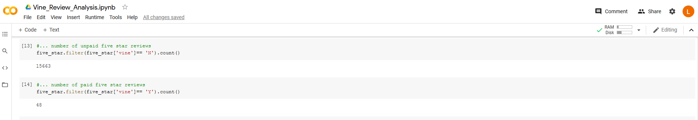
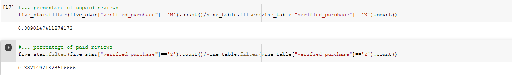

# Amazon_Vine_Analysis
## Overview of the Analysis
The main purpose of this project is to analyze reviews posted by members of the Amazon Vine, which is a program, according to Amazon, 'was created to provide customers with more information including honest and unbiased feedback from some of Amazon's most trusted reviewers.' That way we can see the difference between vine reviewers and non-vine reviewers, and answering questions that are relative to this analysis assignment. 
In this analysis, I used PySpark to extract the data, connected to AWS RDS, and load the data into pgAdmin. Among the list of the dataset I choose to review the video games review dataset, and to see how many reviewers are vine members, how many 5 stars are posted by vine reviewers. 

## Results
### Answering the following questions: 
- How many Vine reviews and non-Vine reviews were there?

According to the screenshot above, we can see that there are 94 reviews are part of the vine program (paid), and there are 40471 reviews are not part of the vine program (unpaid). 
- How many Vine reviews were 5 stars? How many non-Vine reviews were 5 stars?

As we can see from the screenshot above, there are 48 five star vine reviews, and 15663 non-vine reviews. 
- What percentage of Vine reviews were 5 stars? What percentage of non-Vine reviews were 5 stars?

As we can see from the screenshot above, the percenage of vine reviews that are 5 stars is: 38.21%; The percentage of non-vine reviews are 5 stars is: 38.9%. 

## Summary
### State if there is any positivity bias for reviews in the Vine program. 
So I know in some cases in China, people are paying people to post positive reviews online to make their product look better and increase the possibility of people buying it, because if I'm shopping online, and I see a lot of positive reviews, I'll be more likely to buy their stuff, likewise, if I'm posting reviews, and I see most of the reviews are positive, so I'll be more likely to follow them and post positive reviews, so this is positive bias. 
In my analysis, the result is showing that vine five star review percentage is 38.21%
